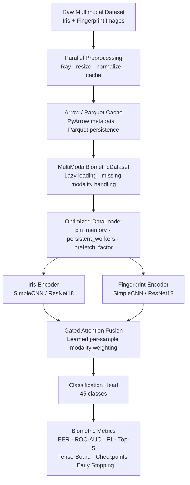
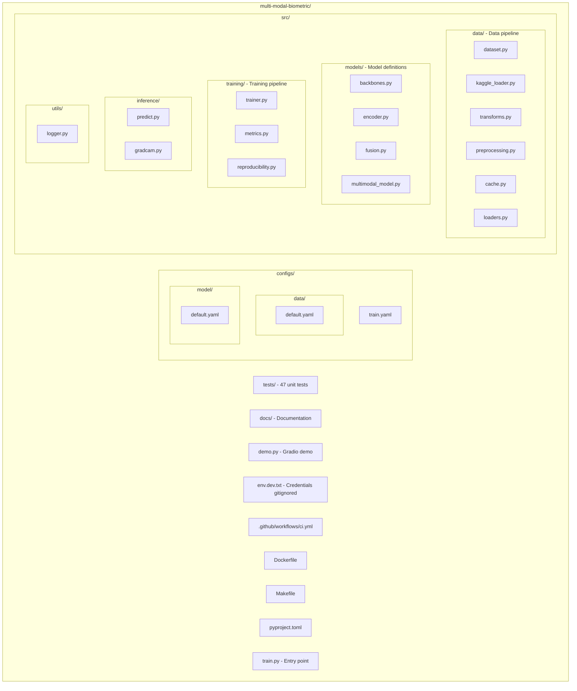
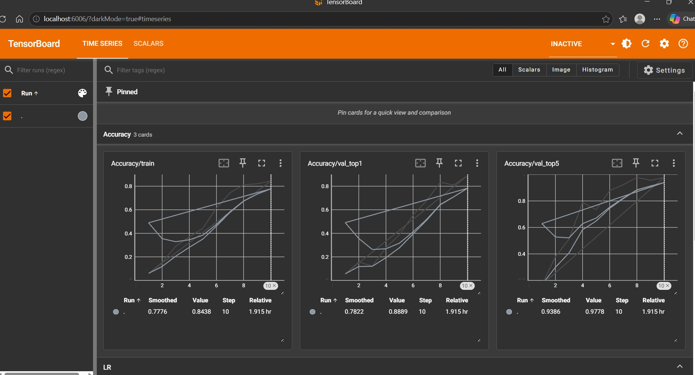
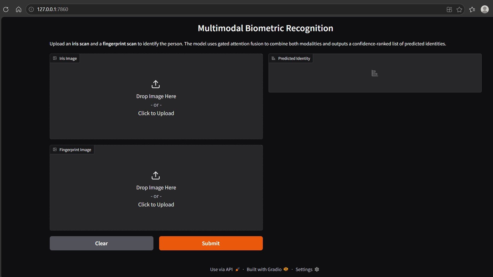
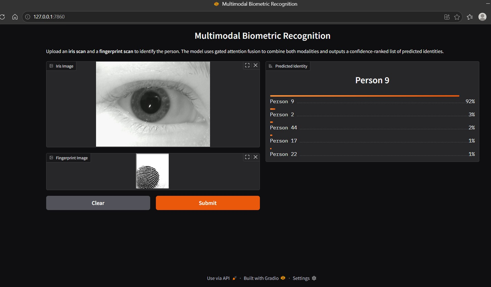

# Scalable Multimodal Biometric Recognition Pipeline

A production-ready Machine Learning (ML) infrastructure for iris + fingerprint biometric recognition, built with a focus on **scalability** and **reproducibility**.

## Overview

A multimodal training pipeline for biometric recognition (iris + fingerprint).

Dataset: [Multimodal Iris & Fingerprint Biometric Data](https://www.kaggle.com/datasets/ninadmehendale/multimodal-iris-fingerprint-biometric-data) - 45 subjects.

## Training Results

> Trained with gated attention fusion, cosine annealing Learning Rate (LR), seed=42, 20 epochs on CPU.

| Metric | Value |
|--------|-------|
| **Top-1 Accuracy** | 34.4% |
| **Top-5 Accuracy** | 73.3% |
| **Receiver Operating Characteristic - Area Under the Curve (ROC-AUC) macro** | **0.919** |
| **Equal Error Rate (EER)** | **0.169** |
| **F1-Score (macro)** | 0.274 |
| **Training Time** | 136s on CPU |

### Training Progression

```
Epoch  Train Loss  Val Loss  Top1    Top5    ROC-AUC   EER
─────  ──────────  ────────  ──────  ──────  ───────   ─────
  1      3.989      3.868    1.1%    4.4%    0.616     0.498
  5      3.199      3.417    6.7%   35.6%    0.779     0.350
 10      2.451      3.767    4.4%   24.4%    0.806     0.353
 15      2.040      2.593   21.1%   64.4%    0.898     0.192
 20      1.869      2.352   34.4%   73.3%    0.919     0.169
```

> **Note**: Top-1 accuracy is modest due to 45-class classification with only ~8 train samples per class. The high Receiver Operating Characteristic - Area Under the Curve (ROC-AUC) (0.92) and low Equal Error Rate (EER) (0.17) confirm the model discriminates well between identities - the biometric-standard metrics that matter.


## Architecture



## Project Structure



## Setup

### Prerequisites

- Python 3.10+
- [uv](https://docs.astral.sh/uv/getting-started/installation/) - fast Python package manager

### Installation

```bash
# Clone and install
git clone <repo-url>
cd multi-modal-biometric
uv venv --python 3.12
uv sync --all-extras

# Option 1: Automatic download from Kaggle (requires credentials)
uv run python train.py data.kaggle.enabled=true

# Option 2: Manual download
# Download dataset from Kaggle and extract to configs/data/
# Expected path: configs/data/IRIS and FINGERPRINT DATASET/
```

#### Kaggle Credentials (for automatic download)

Create an `env.dev.txt` file in the project root with your Kaggle API token:

```bash
KAGGLE_API_TOKEN=<your-token>
```

Get your token from [kaggle.com/settings/api](https://www.kaggle.com/settings/api). The file is gitignored by default.

Alternatively, export the variable directly:

```bash
export KAGGLE_API_TOKEN=<your-token>
```

### Training

```bash
# Default config (attention fusion, cosine LR, early stopping)
uv run python train.py

# Override config values
uv run python train.py training.epochs=10 training.batch_size=16 training.device=cpu

# Use concat fusion instead
uv run python train.py model.fusion.strategy=concat

# Use ResNet18 backbone
uv run python train.py model.iris_encoder.backbone=resnet18 model.fingerprint_encoder.backbone=resnet18

# Complete can be like below
uv run python train.py data.kaggle.enabled=true training.epochs=10 training.batch_size=16 training.device=cpu model.fusion.strategy=concat model.iris_encoder.backbone=resnet18 model.fingerprint_encoder.backbone=resnet18
```

### Monitoring

```bash
uv run tensorboard --logdir runs/
```


### Inference & Visualization

```bash
# Single prediction
uv run python -m src.inference.predict --checkpoint checkpoints/best_model.pt \
    --iris path/to/iris.bmp --fingerprint path/to/fp.bmp

# Grad-CAM explainability
uv run python -m src.inference.gradcam --checkpoint checkpoints/best_model.pt \
    --iris path/to/iris.bmp --fingerprint path/to/fp.bmp --output gradcam.png
```

### Interactive Demo (Gradio)

```bash
# Install Gradio (if not already installed)
uv pip install gradio

# Launch the demo
uv run python demo.py
```

This opens a web UI at **http://localhost:7860** in your browser.

**Inputs:**
- Upload an iris scan image (`.bmp`, `.jpg`, `.png`)
- Upload a fingerprint scan image (`.bmp`, `.jpg`, `.png`)



**Output:** Top-5 predicted identities ranked by confidence score.



> The demo loads `checkpoints/best_model.pt` automatically. Train the model first or use a pre-existing checkpoint.

### Testing

```bash
uv run pytest tests/ -v   # 47 tests
```

### Formatting

```bash
make format
```

### Docker

```bash
docker build -t biometric-pipeline .
docker run -v $(pwd)/data:/app/data biometric-pipeline
```

## Design Decisions

| Decision | Rationale |
|----------|-----------|
| **Gated Attention Fusion** | Learns per-sample modality weights; outperforms naive concatenation. Registry supports swapping strategies via config |
| **Equal Error Rate (EER) + Receiver Operating Characteristic - Area Under the Curve (ROC-AUC) metrics** | Industry-standard biometric evaluation; accuracy alone is insufficient for identity verification |
| **Cosine Annealing Learning Rate (LR)** | Smooth decay avoids learning rate cliffs; better convergence than step decay |
| **Early stopping + best model** | Prevents overfitting; always keeps the best checkpoint available |
| **Automatic Mixed Precision (AMP)** | Near-free 2x throughput on GPU; auto-disabled on CPU |
| **TensorBoard logging** | Zero-dependency visualization (bundled with PyTorch); loss, metrics, LR per epoch |
| **Hydra for config** | Composable YAML configs, CLI overrides, no hardcoded values |
| **Ray for preprocessing** | Scales from local to cluster; graceful fallback to sequential |
| **PyArrow metadata cache** | Columnar format for fast metadata lookups; persisted as Parquet |
| **Grad-CAM** | Model interpretability: visual proof the model attends to biometric features |
| **structlog** | Structured key-value logging for production observability |

## Scalability Considerations

- **Dataset 100x larger**: Ray preprocessing scales horizontally across nodes. Arrow cache avoids filesystem scans. DataLoader `num_workers` and `prefetch_factor` keep GPUs fed.
- **Azure Blob Storage**: Replace local paths with `azure-storage-blob` SDK reads. Cache preprocessed data locally or on fast Non-Volatile Memory Express (NVMe) to avoid network bottleneck.
- **Multi-GPU**: Wrap model with `DistributedDataParallel`, use `DistributedSampler` in DataLoader.
- **Kubernetes**: Docker container is deployment-ready. Scale training pods with GPU scheduling. Use persistent volumes for data and checkpoints.

## Future Improvements

- MLflow experiment tracking
- `torch.profiler` integration for GPU bottleneck analysis
- Dataset versioning with Data Version Control (DVC)
- Hyperparameter sweep with Hydra multi-run
