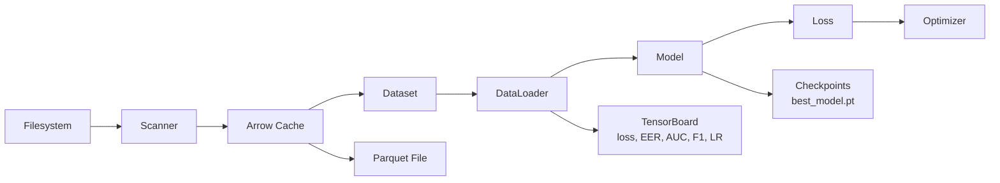

# Architecture Overview

## System Design

The system follows a modular pipeline architecture where each stage is independently testable and replaceable.

### Data Flow

### Module Responsibilities

| Module | Responsibility | Interface |
|--------|---------------|-----------|
| `data/kaggle_loader.py` | Load credentials from `env.dev.txt`, download dataset from Kaggle if needed | `ensure_dataset()` → `str` (dataset path) |
| `data/dataset.py` | Scan filesystem, pair modalities, lazy-load images | `__getitem__` returns `{iris, fingerprint, label}` |
| `data/preprocessing.py` | Resize, normalize, extract metadata in parallel | `preprocess_single_image()` - stateless, Ray-compatible |
| `data/cache.py` | Build and persist Arrow metadata tables | `build_metadata_table()` → `pa.Table` |
| `data/loaders.py` | Create train/val DataLoaders with optimal settings | `create_dataloaders()` → `(DataLoader, DataLoader)` |
| `data/transforms.py` | Image augmentation (train) and normalization (eval) | `get_train_transforms()` / `get_eval_transforms()` |
| `models/backbones.py` | SimpleCNN / ResNet18 encoder backbones | `build_encoder(backbone, ...)` → `nn.Module` |
| `models/fusion.py` | Concat + Gated Attention fusion strategies | `build_fusion(strategy, ...)` → `nn.Module` |
| `models/multimodal_model.py` | End-to-end model composing encoders + fusion | `MultiModalBiometricModel.forward()` |
| `training/trainer.py` | Training loop with TensorBoard, AMP, early stopping | `Trainer.fit()` → `list[dict]` |
| `training/metrics.py` | EER, ROC-AUC, F1, Top-k accuracy, confusion matrix | `compute_epoch_metrics()` → `dict` |
| `training/reproducibility.py` | Seed all RNGs deterministically | `seed_everything(seed)` |
| `inference/predict.py` | Load checkpoint, run single-sample inference | `predict_single()` → `dict` |
| `inference/gradcam.py` | Grad-CAM heatmap visualization | `visualize_gradcam()` → saved image |

### Fusion Strategies

The model supports two fusion strategies, selectable via `model.fusion.strategy`:

- **`concat`** - Concatenates iris + fingerprint embeddings, classifies via MLP. Simple baseline.
- **`attention`** - Gated attention fusion: a learned gate network outputs per-sample softmax weights over both modalities. The fused representation is a weighted combination, allowing the model to rely more on whichever modality is more informative for each input.

### Configuration System

Hydra enables:
- **Composable configs**: `configs/train.yaml` imports `data/default.yaml` and `model/default.yaml`
- **CLI overrides**: `python train.py training.epochs=5 model.fusion.strategy=attention`
- **No hardcoded values**: All parameters externalized

### Missing Modality Handling

When a modality is absent for a sample, the dataset returns a zero tensor of the expected shape. This allows:
- Graceful degradation without crashes
- The model to learn from available modalities
- The gated attention fusion to down-weight the missing modality

### Training Features

| Feature | Implementation |
|---------|---------------|
| **TensorBoard** | `SummaryWriter` logs loss, accuracy, F1, AUC, EER, LR per epoch |
| **Mixed Precision (AMP)** | `torch.amp.autocast` + `GradScaler`; auto-disabled on CPU |
| **Cosine Annealing LR** | Smooth decay from initial LR to `1e-6` over training |
| **Early Stopping** | Tracks best val loss; stops after `patience` epochs without improvement |
| **Best Model Tracking** | Auto-saves `best_model.pt` whenever val loss improves |

### Data Pipeline Performance

The DataLoader is configured for maximum GPU utilization:

| Setting | Purpose |
|---------|---------|
| `pin_memory=True` | Faster CPU→GPU transfer via DMA |
| `persistent_workers=True` | Avoid worker re-spawn per epoch |
| `prefetch_factor=2` | Overlap data loading with computation |
| `num_workers=4` | Parallel data loading |
| `drop_last=True` (train) | Consistent batch sizes for BatchNorm |
